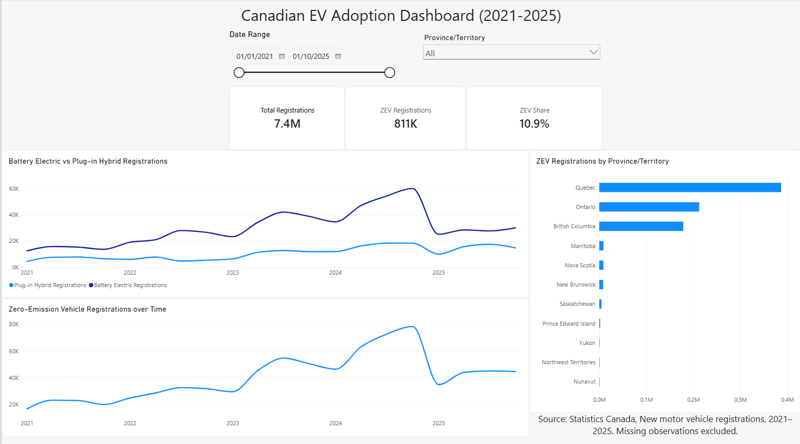

# Canadian EV Adoption Dashboard

A Power BI dashboard exploring Canadian electric vehicle registration
trends from 2021–2025 using Statistics Canada data.

## Overview

This dashboard explores:
- Zero-emission vehicle adoption over time
- Battery electric vs. plug-in hybrid registrations
- ZEV registrations across Canadian provinces and territories
- ZEV share of total vehicle registrations

## Tools

- Power BI
- Power Query
- Basic DAX measures

## Data

Source: Statistics Canada, New Motor Vehicle Registrations.

The dataset was cleaned and transformed in Power Query. Missing
registration values were treated as unavailable data rather than zero.

## Dashboard Features

- Interactive date-range filtering
- Province/territory filtering
- KPI cards for total registrations, ZEV registrations, and ZEV share
- Quarterly EV adoption trends
- Provincial/territorial comparisons

## Power BI File

The `.pbix` file is included in this repository for anyone who wants
to explore the report locally in Power BI Desktop.
